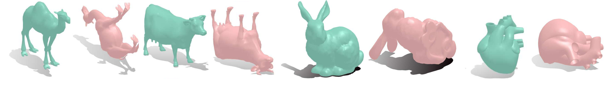

# 3DPrint Projects

## Abstract

3D printing is gaining ground in many areas around the world, being used in construction, modeling and mockups, educational purposes and for health research, as well as in the printing of body parts for surgery assistance. When the printer needs to print a 3D surface, some of the parts may be suspended in the air, requiring support for better printing. These supports are detached from the object and are discarded, generating waste of material and money. This work proposes a new approach for this problem of 3D surface printing based on the normal field of surfaces, which seeks a global surface orientation, so that, after rotating the surface by the obtained orientation, its printing generates as less support as possible.

\vspace{1pt}

**Keywords**: 3D printing, normal field, support, overhang, optimization.

We present some of the source codes written in Matlab to apply the optimization method to find the global minimum of problem. The functions are divided in two parts: *main functions* and *auxiliary functions*. Other auxiliary functions were used, such as **readOBJ.m**, **tsurf.m** and are available on **gptoolbox** (JACOBSON et al., 2018) website. Also, the surfaces that were used for tests here are available on **libigl** (JACOBSON, PANOZZO et al., 2018) website.
